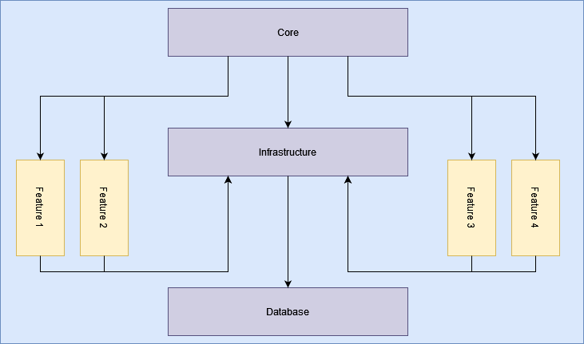
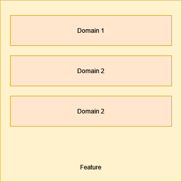
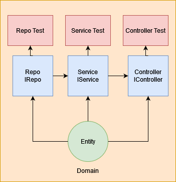

# Structor.Net

This is a starter project for a .NET application. 

My aim is to make this modular and to follow best practices as much as possible. 

---

## Project Structure 
This projects try to follow  clean architecture and vertical slice architecture. 



1. [Core](#core)
2. [Infrastructure](#infrastructure)
3. [Features](#features)
4. [Database](#database)

###  Core
This will be the entry point to the project bootstrapping and holding everything together. 
It contains: 

    a. Extensions => Where global extension methods are added (ie: IQueryableExtension.cs).
    b. Globals => Global and AppSettings consts.
    c. Helpers => Helper classes. 
    e. Setups => Adding global settings (ie: Testing Settings).
    f. CoreServicesCollection => Where services are to be registered.  
    g. CoreAppCollection => Where App usings and middlewares are to be registered.


### Infrastructure
This will contain shared services across the application.
It contains: 

    a. DatabaseContext => For global context `CoreDbContext` 
        CoreDbContext is created as a partial class so that features could extend it with their own entities without leaving the feature folder.
    b. DTOs => Base DTO and Global DTOs that are shared between features. (ie: ResponseDTO)
    c. Entities => Base Entity and Global Entities that are shared between features. (ie: IEntity)
    e. Repositories => Base abstract Repository and IRepository and Project's Unit of work (if it were to be implemented). Other Repositories would inherit the functionality of the base repository.
    f. Services => Services that are shared between Repositories.
    g. InfrastructureServicesCollection => Where infrastructure services are to be registered.  


Note: 
* CoreDbContext is instantiated with the QueryTrackingBehavior NoTracking. 
This greatly improves performance but on implementing a dbset update method you must first reattach the entity to the context (which base Repository already does with its update).
* Added DbContexts could: 
    1. Follow the same pattern by setting either .UseQueryTrackingBehavior(QueryTrackingBehavior.NoTracking)
    2. Set it up in the constructor _context.ChangeTracker.QueryTrackingBehavior = QueryTrackingBehavior.NoTracking.
    3. Keep the default behavior. 

### Features 
1. Each feature consists of multiple domains 

2. Each domain starts with an entity and the Repository and Services class for that Entity and a Controller if it needs one.


###### New Modules/Features will: 
1. Register their services in `<Feature>ServicesCollection`.
2. Register their services collection to the `CoreServicesCollection's AddFeaturessServices`.
3. Add their entities and domain models to the `<Feature>DbContextExtension` `DbContext` partial class as `DbSet` or implments its own context and register it. 
3. Each feature contains its own unit tests next to the class it tests. This might be frowned upon because the build will include the tests on production but I found a clever way to avoid this: 
    - In csproj I added the following: 
	```
	<ItemGroup Condition="'$(Configuration)' == 'Release'">
		<Compile Remove="**\*.Tests.cs" />
	</ItemGroup>
	<ItemGroup Condition="'$(Configuration)' != 'Release'">
		<PackageReference Include="coverlet.collector" Version="3.2.0">
			<PrivateAssets>all</PrivateAssets>
			<IncludeAssets>runtime; build; native; contentfiles; analyzers; buildtransitive</IncludeAssets>
		</PackageReference>
		<PackageReference Include="Microsoft.NET.Test.Sdk" Version="17.5.0" />
		<PackageReference Include="xunit" Version="2.4.2" />
		<PackageReference Include="xunit.runner.visualstudio" Version="2.4.5">
			<PrivateAssets>all</PrivateAssets>
			<IncludeAssets>runtime; build; native; contentfiles; analyzers; buildtransitive</IncludeAssets>
		</PackageReference>
	</ItemGroup>
	```
	The above ensures that in the Release configuration all the files named *.Tests.cs are excluded from compilation, and also that the required unit testing package references are removed.

### Database
Each Module will interact with the database using the Entity Framework's DBContext either the main application context or a seperate context for that Feature


### Design Choices
